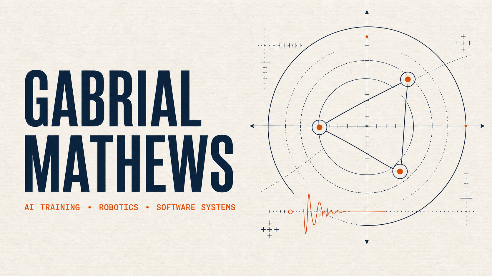

  

# Gabrial Mathews

**Robotics simulation · AI evaluation · Applied mathematics · Independent software**

I build systems where an AI-generated result has to be testable, inspectable, and useful—not merely plausible. Since March 2024, my work has progressed from mathematics and physics training data through expert review and quality control into simulation-based robotics evaluation.

Today I build MuJoCo environments, policy interfaces, reference controllers, diagnostics, and deterministic evaluations for professional AI-training work. Outside of contracting, I develop GraphDat, an AI-assisted editable-geometry and graphing tool, and a private materials-cost and review system.

[LinkedIn](https://www.linkedin.com/in/gabrial-mathews-04768a268/)

I am open to full-time roles in robotics simulation, embodied-AI evaluation, AI training and data systems, and applied ML engineering.

## Current work

### Robotics simulation and policy evaluation

I create MuJoCo problems in which an AI system writes a policy that turns live observations into physical actions. I own the complete authoring loop:

- design the simulation environment and physical objective;
- define the observation-and-action interface;
- develop a capable reference controller to establish feasibility;
- build deterministic scoring, diagnostics, and reviewer-facing evidence; and
- test behavior under uncertainty, disturbances, delays, contact, and recovery conditions.

The work includes aerial sensing and planning, coordinated multi-robot behavior, and precision navigation. Source code, prompts, evaluation internals, and reconstructive task details remain private.

### [GraphDat — AI-assisted graphing and editable geometry](https://github.com/Gabesm13/graphdat-showcase)

GraphDat is an AI-assisted tool for turning written or dictated geometry instructions into structured, editable constructions. The private product combines learned interpretation with deterministic validation, state, execution, editing, and rendering.

An experimental image-to-mesh workflow also converts visual regions into editable polygon geometry. The work combines transformer fine-tuning, dataset engineering, semantic evaluation, API development, image processing, and spatial representation.

The public repository is a separate, model-free geometry-engineering showcase with typed objects, explicit dependencies, atomic transactions, history, deterministic exports, and a runnable synthetic example. The commercial core, training data, model artifacts, and implementation recipes remain private while the product develops.

### [Materials Cost Tracker](https://github.com/Gabesm13/materials-cost-demo)

This private, local-first product turns heterogeneous vendor documents into reviewable material-price history. Its workflow emphasizes source provenance, reconciliation, exception-first human review, guarded approvals, and recovery controls.

The public repository is a sanitized, runnable cost-and-procurement workflow showcase built from fabricated purchasing records. It demonstrates typed inputs, exact decimal arithmetic, explicit review states, transactional SQLite persistence, source-linked price history, and deterministic reporting without exposing production source, vendor records, or proprietary parsing logic.

## Public code

These repositories use synthetic data and are intended as compact, inspectable examples of Python data modeling and interactive visualization.

| Project | What it demonstrates |
| --- | --- |
| [GraphDat Geometry Showcase](https://github.com/Gabesm13/graphdat-showcase) | Model-free editable-geometry engine with dependency tracking, atomic transactions, undo/redo, validation, and deterministic review artifacts |
| [Materials Cost Demo](https://github.com/Gabesm13/materials-cost-demo) | Synthetic cost-and-procurement review workflow with provenance, exception routing, SQLite persistence, and deterministic reporting |
| [Procurement Dashboard](https://github.com/Gabesm13/Procurement-Dashboard) | Python and Plotly dashboarding, synthetic procurement data, cost and ROI analysis |
| [Sunburst Dashboard](https://github.com/Gabesm13/Sunburst-Dashboard) | Hierarchical data construction and six-level interactive navigation analysis |
| [Retention Dashboard](https://github.com/Gabesm13/Retention-Dashboard) | Synthetic-data generation and interactive retention and withdrawal analysis |

## Technical toolkit

- **Robotics and evaluation:** MuJoCo, controller-policy design, simulation, observation/action schemas, reference baselines, deterministic evaluation, failure analysis
- **Models and perception:** PyTorch, transformer fine-tuning, structured action generation, raster-to-geometry processing, semantic evaluation
- **Engineering:** Python, FastAPI, Docker, CI/CD, SQL and SQLite, data provenance, automated testing, human-in-the-loop review
- **Visualization:** GeoGebra, Plotly, interactive geometry, technical media, reviewer-facing evidence

## Background

- Independent AI contractor through Alignerr, focused on robotics simulation and policy evaluation
- AI training, expert review, and quality control through Outlier AI / Scale AI since March 2024
- B.S. in Applied Mathematics, Honors, Montana State University
- Associate of Arts, Gallatin College Montana State University
- Music Technology studies and long-running work in performance, recording, editing, mixing, and mastering

## Public/private boundary

Much of my current robotics and product work is confidential or commercially proprietary. The public material is deliberately selected to demonstrate the engineering without exposing client data, source code, private evaluations, production datasets, or product-critical implementation details.
